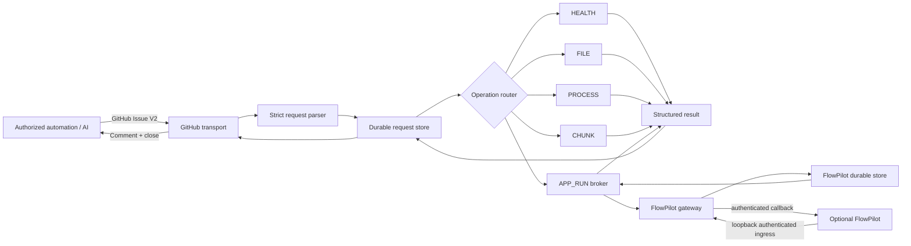

# Architecture

RBridge is intentionally split into **transport**, **validation**, **durable state**, **bounded execution adapters**, and **result publication**.

## High-level flow

## Components

### 1. GitHub Issue transport

`src/adapters/githubIssueRemoteBridge.ts`

The public asynchronous transport uses GitHub Issues:

- lists open Issues in exactly one configured repository;
- accepts only titles with the request prefix;
- filters to the configured trusted author;
- publishes JSON result comments;
- chunks oversized result publications with SHA-256 manifests;
- closes completed requests.

The GitHub transport is not the authorization boundary by itself. The V2 parser re-validates repository and author identity.

### 2. V2 protocol parser

`src/domain/remoteBridgeStage2Protocol.ts`

The parser:

- enforces exact top-level and operation-specific fields;
- validates canonical timestamps and request TTL;
- rejects unknown operation kinds/actions;
- bounds request body, args, timeout and output limits;
- rejects request-controlled process executable paths;
- hashes canonical request semantics for durable identity.

### 3. Durable request store

`src/server/remoteBridgeStore.ts`

Before/reliably around side effects, the worker maintains durable request state. A requestId cannot silently mean two different requests:

- same requestId + same digest can replay;
- same requestId + different digest becomes a collision;
- published/terminal state survives process restart.

This is a key difference between RBridge and a simple remote command transport.

### 4. Operation router

`src/server/remoteBridgeWorker.ts`

V2 operations route to separate bounded capabilities:

- `APP_RUN`
- `FILE`
- `PROCESS`
- `CHUNK`
- `HEALTH`

Errors are classified into terminal states rather than blindly retried when execution may already have happened.

### 5. Source-controlled host profiles

`src/domain/remoteBridgeHostProfiles.ts`

The current public profile defines:

- FILE root: `/mnt/data`
- process profile IDs: `git-read`, `node-safe`, `stdin-echo`
- process lifetime/output bounds
- chunk bounds
- safe health fields

The request can select an allowed profile; it cannot supply an executable path.

### 6. File adapter

`src/server/remoteBridgeFileOps.ts`

File operations apply multiple layers:

- absolute lexical path validation;
- source-controlled allowed roots;
- real-root verification;
- symlink denial along the path;
- common secret-path/name blocking;
- bounded reads/searches;
- atomic writes;
- SHA-256 checks for binary writes.

### 7. Process-session subsystem

`src/server/remoteBridgeProcessSessions.ts` and `remoteBridgeProcessSupervisor.ts`

Processes are not one-shot shell strings. A START creates a durable supervised session tied to the request digest. Follow-up operations use a session ID and owner digest.

Output is cursor-based and bounded. Input is permitted only when the selected source profile allows it. Termination is bounded and records uncertain states when process identity cannot be proven safely.

### 8. Chunk store

`src/server/remoteBridgeChunkStore.ts`

Large binary/object movement is modeled as chunk transfers with:

- transfer IDs;
- exact chunk count;
- per-chunk SHA-256;
- complete-object SHA-256;
- expiration;
- durable manifest;
- replay/collision behavior;
- bounded total size.

### 9. Health

`src/server/remoteBridgeHealth.ts`

HEALTH exposes a deliberately small operational snapshot rather than internal state:

- release SHA
- uptime
- queue count
- active process-session count
- active transfer count
- last GitHub poll timestamp

### 10. Optional controller broker

`APP_RUN` and FlowPilot operations use the controller adapter.

The public adapter expects a compatible broker at the configured/source controller socket. This separates RBridge's host-facing authorization/durability role from application-specific execution.

### 11. Optional FlowPilot bridge

When explicitly enabled, RBridge starts a loopback-only ingress. It has its own bearer token, callback token, callback URL validation and durable FlowPilot store.

See [FlowPilot integration](FLOWPILOT.md).

## Trust boundaries

RBridge assumes different trust levels:

1. **Untrusted request data** — always parsed/validated.
2. **Configured remote identity** — GitHub repository and author are explicit deployment trust roots.
3. **Source-controlled policy** — allowed roots/process profiles are code/release properties, not request properties.
4. **Runtime OS identity** — dedicated non-root user with deployment file permissions.
5. **Optional controller broker** — separately trusted execution authority for APP_RUN/FlowPilot.
6. **Durable state** — treated as security-sensitive; corruption causes fail-closed behavior.

## Why GitHub Issues?

GitHub Issues provide a practical asynchronous control plane:

- globally reachable without opening an inbound RBridge port;
- authenticated by GitHub;
- human-visible request/result history;
- natural queue semantics;
- result comments survive client disconnects.

Trade-offs:

- polling latency;
- GitHub API/rate-limit dependency;
- GitHub account/repository security becomes part of the trust model;
- not ideal for high-frequency low-latency tasks.

The optional loopback FlowPilot ingress exists for a different operating mode.

## Deployment lifecycle

RBridge deliberately treats these as separate:

1. source correctness;
2. exact-commit CI;
3. staged release integrity;
4. live deployment acceptance.

A green source commit is not automatically proof that a particular host is safely deployed.
