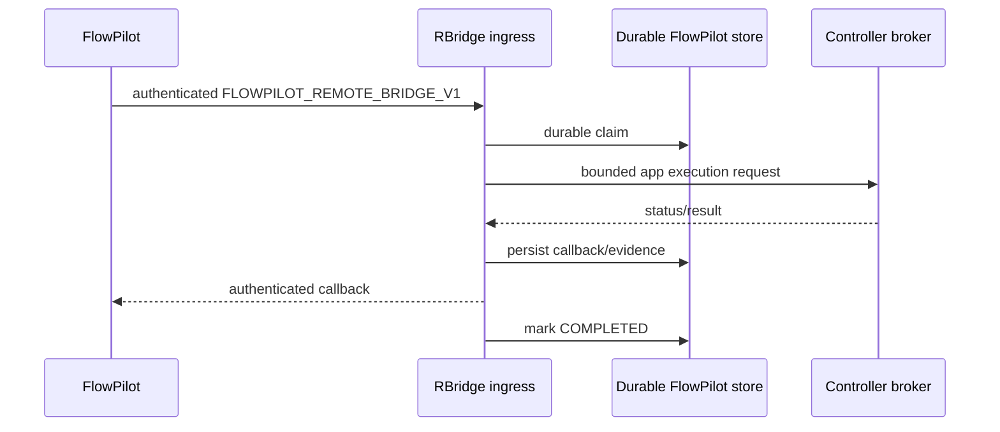

# FlowPilot integration

RBridge includes an **optional loopback-only FlowPilot bridge** for deployments that need lower-latency workflow execution than the GitHub Issue polling transport.

It is disabled by default.

## Enablement

Set:

```text
COCWIN_FLOWPILOT_INGRESS_ENABLED=true
```

and provide:

```text
FLOWPILOT_REMOTE_BRIDGE_TOKEN=<secret>
FLOWPILOT_CALLBACK_TOKEN=<different-secret>
```

The ingress default is:

```text
127.0.0.1:8098
```

and the default callback is:

```text
http://127.0.0.1:8097/api/v1/executor/callback
```

Only literal loopback ingress hosts are accepted.

## Data flow



## Operation envelope

The ingress parser requires exact fields including:

- schema;
- operationId;
- runId;
- stepId;
- attempt;
- fencingToken;
- idempotencyKey;
- appId;
- action;
- payload;
- timeoutSeconds;
- callback.

Callback bearer material is validated but not persisted in the normalized operation.

## Supported public action contracts

Current public source supports four action identities:

### `fpilot / APP_PROBE_V1`

Payload:

```json
{}
```

Maps to a fixed probe controller execution.

### `cocwin / COCWIN_MASTER_POLICY_HEALTH_V1`

Payload:

```json
{
  "expectedPolicySha256": "<64-lowercase-hex>"
}
```

Maps to a fixed policy-health program.

### `cocwin / COCWIN_REFRESH_SNAPSHOT_V1`

Payload:

```json
{}
```

Maps to a fixed snapshot-refresh program.

### `cocwin / COCWIN_CONTINUOUS_QUALIFICATION_V1`

Payload:

```json
{}
```

Maps to a fixed bounded qualification program.

The COCWIN-specific actions are examples of deployment/application integration, not a requirement for the base GitHub V2 transport.

## Deployment URL

The COCWIN action programs derive deployment endpoints from:

```text
RBRIDGE_COCWIN_POLICY_URL
```

The public compiled source does not need to embed a private host IP.

## Durable store

FlowPilot operation records are stored under the RBridge state root's `flowpilot` directory.

Durability includes:

- deterministic operation digest;
- deterministic app/job identity;
- claim before submit;
- exact replay;
- collision rejection;
- phases:
  - `CLAIMED`
  - `SUBMITTED`
  - `CALLBACK_PENDING`
  - `COMPLETED`
- completed-history tombstones/retention.

## Evidence

Callbacks carry action-specific evidence rather than raw execution output.

Schemas include:

- `COCWIN_FLOWPILOT_APP_PROBE_EVIDENCE_V1`
- `COCWIN_FLOWPILOT_MASTER_POLICY_HEALTH_EVIDENCE_V1`
- `COCWIN_FLOWPILOT_REFRESH_SNAPSHOT_EVIDENCE_V1`
- `COCWIN_FLOWPILOT_CONTINUOUS_QUALIFICATION_EVIDENCE_V1`

Evidence records bounded fields such as controller state, return code, timeout/truncation flags and result digest.

## When to use which transport

Use **GitHub Issues** when you want:

- asynchronous globally reachable control without opening an inbound port;
- human-readable request/result history;
- low operational coupling between caller and host.

Use **FlowPilot ingress** when you already run FlowPilot/controller infrastructure locally and want:

- lower latency;
- workflow run/receipt/outbox lifecycle;
- frequent scheduled operations;
- callback-driven completion.

Do not expose the current FlowPilot ingress directly to an untrusted network. It is intentionally loopback-only.
